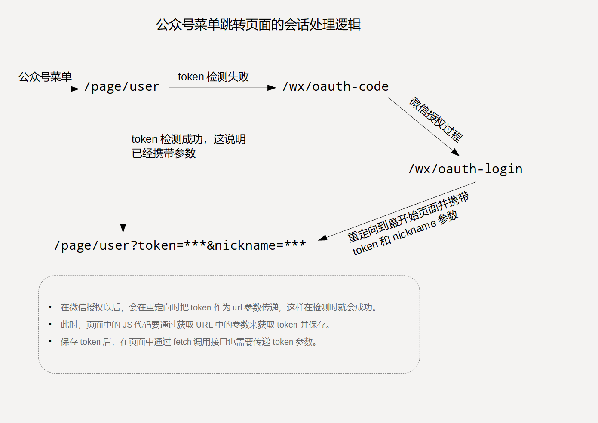

## API文档

----

所有接口都在域名：https://api.modelese.cn/ 下。所有接口遵循RESTFul模式，所有提交数据的格式都按照JSON文本提交。消息头content-type统一设置为text/plain，注意不需要设置成application/json，程序会自动解析处理。

### 权限

依靠微信的用户体系，这要求依据微信公众号的OpenID作为用户唯一标识，当用户通过微信打开页面时，会进行微信授权的过程。所有的接口操作都要在此基础上完成，相当于在请求时，中间件经过这一层会话验证处理。

**所有接口都要在url上携带token参数**

### 接口返回值

返回值为JSON格式，其中status字段肯定存在，status为'OK'，表示执行成功，否则表示失败，同时会有errmsg描述错误信息。

**成功返回值**

```
{
    "status": "OK",
    "data" : DATA
}
```

**失败返回值示例**

```
{
    "status" : "EFAILED",
    "errmsg" : "set point failed"
}
```

<br>

所有处理过程都需要在会话token检测通过的情况下进行，而页面跳转和接口调用都需要token，这要求两种模式都要满足，在接口来说，只需要获取到token时，通过fetch调用接口携带token即可，而对于页面来说，在微信菜单中跳转的链接是固定的，具体的会话处理逻辑如下图示。

### 会话处理逻辑



### 积分管理接口

**提交垃圾收取信息并获取积分验证码**

```
请求：POST
接口：/user/point

提交数据格式：JSON文本
content-type设置为text/plain

数据字段:

{
    "point_type" : ""
    "points" : "",
    "post_trash" : "",
    "trash_weight" : "",
    "trash_type" : ""
}

正确返回值：
{
    "status" : "OK",
    "data" : "1234945"
}

错误返回值示例：
{
    "status" : "EFAILD"
    "errmsg" : "请求失败"
}

```

**获取用户的积分记录总数**

```
请求：GET
路径：/user/point-count

返回值：

{
    "status" : "OK",
    "data" : 10
}

```

**获取用户当前积分等基本信息**

```
请求：GET
路径：/user/info

返回值：
{
    "status" : "OK",
    "data" : {
        "points" : 100,
        "wxinfo" : {
            //微信授权获取的信息
        }
    }
}
```

**获取积分记录**

```
请求：GET
路径：/user/point
URL参数：offset表示偏移量，表示从第几个记录开始，year是四位数字表示年份，默认为当前年份。
URL参数都不是必须的，offset默认为0。每次返回20条数据。要做分页处理需要使用获取积分记录总数配合。

返回值：
{
    "status" : "OK",
    "data" : [
        {
            "id" : "",
            "point_type" : "",
            "points" : "",
            "trash_weight" : ""
        }
    ]
}

```

